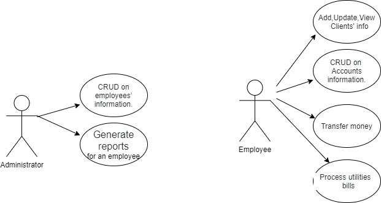
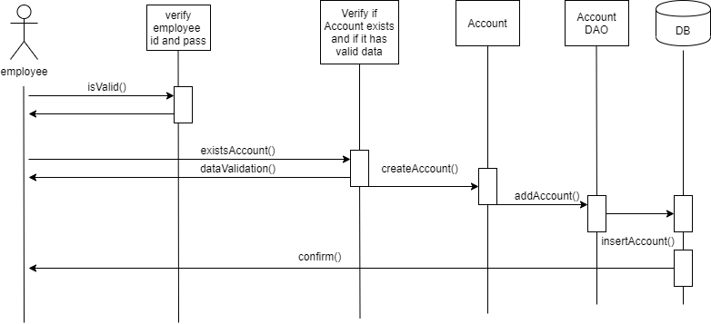

# Analysis and Design Document

# Requirement analysis

## Assignment Specification
The assignment is about an application for the front desk employees of a bank. The application has two types of users : administrator and regular user, where regular users are the bank employees. 

## Function requirements

The administrator supervise all bank employees. He can hire an employee, he view all employees, update their account and fire an employee. The administrator also can generate a report  about every employee with all the actions he performed.

The employees can perform actions on clients, on their accounts, can transfer money between two accounts and can generate a bill for the client he performed actions. Every action has a price. 

One employee can create a client, update a client and view all clients. He can create an account, update, delete and view all accounts.

## Non-functional Requirements
This assignment was developed in Java language combined with a relational database (SQLite). The app use Model - View - Controller pattern, transaction script and a data source pure pattern (table data gateway).

# Use-Case Model

## Use case 1

    * Use case: create new employee
    * Level: one of: administrator goal
    * Primary actor: administrator
    * Main success scenario: the administrator inserts all employee's data correct and he is added to dataBase
    * Extensions: the administrator tryes to create an employee that already exists in dataBase

## Use case 2

    * Use case: update account
    * Level: employee goal
    * Primary actor: employee
    * Main success scenario: the employee inserts all data in the right format and updates the account 
    * Extensions: the employee inserts one field with the wrong format and fails

## Use case 3

    * Use case: transfer money
    * Level: one of: employee goal
    * Primary actor: employee
    * Main success scenario: the employee inserts two vaild ids and the transfer succeed
    * Extensions: the employee inserts one account id that doesnt exist and fails

# System Architectural Design

## Architectural Pattern Description
Layers architectural pattern: The app has four packages (Presentationlogic, where is the UI; Model, where are the table models;DataAcessLogic, where are all the connections with data base; BussinessLogic, where it is the app logic).

## Diagrams
# UML Sequence Diagrams

Create account sequence diagram

# Class Design

## Design Patterns Description
-domain logic pattern (transaction script): every table has  a function for every query for data base.

-data source pure pattern (table data gateway) :every table has a class that calls all the function for data base.

## UML Class Diagram

# Data Model
For the following models i stored:

Account: -account type, amount of money, date of creation

Activity:- the id of the employee who did the action, the description of the action and the date

Client:- name, cnp, its address and phone number

Employee:- name, cnp and salary

Utility :- the client for who was made the actions, description of the utility and price

# System Testing

I tested adding an account to database and extracting the data using Junit 5.  I created an account , added it to data base and then extracting the whole account table in a list of string. The last one should be my account. I verified that with assertTrue. The test passed. 

# Bibliography

- [Online diagram drawing software](https://yuml.me/) ([Samples](https://yuml.me/diagram/scruffy/class/samples))
- [Yet another online diagram drawing software](https://www.draw.io)
