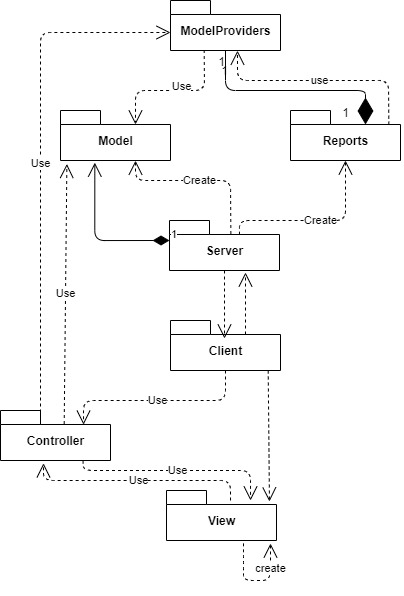

# CHAT Specification
# Elaboration – Iteration 1.1

## Domain Model
Administrator :- username, password

User :- username, password

RepFiles :- type, date, roomId, conversation

Rooms  :-id, userId1, userId2, messages, date 

Messages : id, room, text, date, user

## Architectural Design

### Conceptual Architecture
The app will be developed using Model-View-Controller architectural pattern. In view will be the UI, in model will be all the functions we need to extract data from data base and do realize all the auxiliary problems and in the controller will be the connection between the model and the view.

### Package Design

### Component and Deployment Diagrams

# Elaboration – Iteration 1.2

## Design Model

### Dynamic Behavior
**User - Log In:**

**Admin : Add Room**

### Class Design

**Factory pattern** used when generating the reports file -> for not having to specify the exact [class](https://en.wikipedia.org/wiki/Class_(computer_programming)) of the object that will be created

**Façade pattern** used for grouping all controllers in one -> improve the readability 

### Data Model

### Unit Testing
Testing adding a new client using userProvider and then searching for the client in data base

Testing sending a message using messageProvider and then search it in the console

Testing creating a new chat both as an administrator and as an user

Testing user's status when he is connected and when he is not

# Elaboration – Iteration 2

## Architectural Design Refinement
The architectural patterns used in this project are **Layered pattern** and **Client-server pattern**

With **Layered pattern** I started from the very beginning and later I added **Client-server pattern** for a cleaner communication between front end and back end.

**Pakcage Diagram**

**Deployment Diagram**

**Component Diagram**

## Design Model Refinement

Some changes were made to be able to implement the Client-Server pattern more efficient and to bring the feature where a client gets a notification if other person send a message to him.

# Construction and Transition

## System Testing
The test were made on:

- the client-server connection.
- some administrator functionality : create room, create user, delete user
- some user functionality : star a conversation, block a conversation, create a group, allow an user in a group, deny an user from a group

## Future improvements
- improvements on app stability (better responds on bad inputs)
- improvements on app aesthetics 
- improvements on notifications 
- showing the online/offline status 

# Bibliography
- [Architectural Styles](https://docs.microsoft.com/en-us/azure/architecture/guide/architecture-styles/)
- [Architectural Patterns and Styles](https://msdn.microsoft.com/en-us/library/ee658117.aspx)
- [Design Patterns](https://sourcemaking.com/design_patterns)
- [Online diagram drawing software](https://yuml.me/) ([Samples](https://yuml.me/diagram/scruffy/class/samples))
- [Yet another online diagram drawing software](https://www.draw.io)
