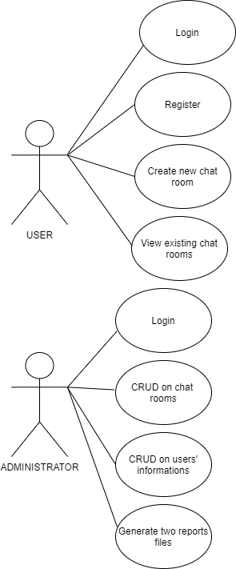

# CHAT Use Case Model

# Use-Cases Identification

## Use case 1
* **Use case**: create new account (register)
* **Level**: user-goal
* **Primary actor**: User
* **Main success scenario**: The user inserts his data in the right sections shown by the interface and creates a correct account.
* **Extensions**: In case the user insert an already used username he will be stopped and asked to reintroduce another one.

## Use case 2
* **Use case**: create new chat room
* **Level**: user-goal
* **Primary actor**: User
* **Main success scenario**: The User select a friend from his friend list and creates a new chat room
* **Extensions**: The friend account user is selecting to chat with is no longer available

## Use case 3
* **Use case**: delete room (CRUD on chat rooms)
* **Level**: administrator-level
* **Primary actor**: Administrator
* **Main success scenario**: Select a chat room and press delete
* **Extensions**: The chat doesn't exist or is already deleted

## Use case 4
* **Use case**: read users' information (CRUD on users' information)
* **Level**: administrator-level
* **Primary actor**: Administrator 
* **Main success scenario**: Select/insert the user name in search field and find all the info about him
* **Extensions**: The administrator inserted the wrong name and it cannot be found

# UML Use-Case Diagrams

# Bibliography

* [Online diagram drawing software](https://yuml.me/) ([Samples](https://yuml.me/diagram/nofunky/usecase/samples))
* [Yet another online diagram drawing software](https://www.draw.io)
